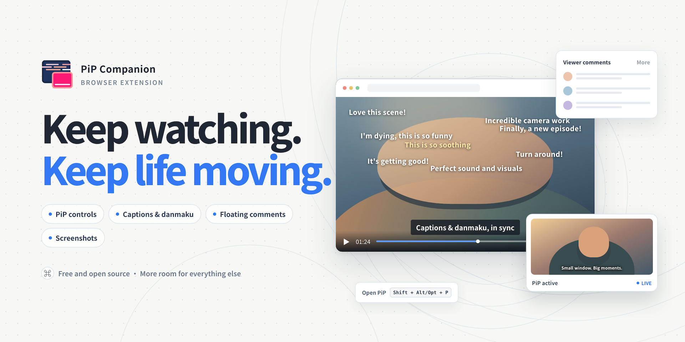

# 幕伴 PiP · PiP Companion

English | [繁體中文](README.zh-TW.md)

A browser extension that brings web videos into Picture-in-Picture, with captions, danmaku, screenshots, and floating comments panels.

<p align="center">
  
</p>

> For problems or feature requests, please report them in [Issues](https://github.com/kir4che/pip-companion/issues).

## Features

- **Picture-in-Picture controls:** play/pause, scrub the timeline, volume, playback speed, frame stepping, and more.
  - **Play next video:** automatically detects the page's "Next video / Next episode" button when available.
  - **Volume boost:** same-origin videos can be boosted up to 300%; cross-origin videos may be limited to 100%.
  - **Playback speed:** adjust from 0.25× to 5×; automatically hidden during live streams to preserve sync, and some websites may impose limits.
  - **Progress bar & previews:** keeps the mini progress bar visible at the bottom when controls fade out, and hover over the seek bar to preview thumbnails (supported on YouTube, Bilibili, and Bahamut Anime Crazy).
  - **Jump to a timestamp:** enter a video time to jump directly to that point.
  - **Captions:** display captions that can be read from the video in PiP, with customizable styles. These settings apply only in PiP and do not affect the website's original player.
- **Danmaku:**
  - Display native danmaku from Bilibili and Bahamut Anime Crazy.
  - Render chat messages from YouTube and Twitch as danmaku.
  - Send danmaku from PiP on Bahamut Anime Crazy, YouTube Live, and Bilibili.
  - Customize danmaku appearance.
- **Floating comments:** open the comments panel on YouTube and Bilibili video pages while watching.
- **Screenshots:** save the video frame as a PNG file.
- **Feature toggles and keyboard shortcuts:** toggle danmaku, screenshots, and floating comments individually; customize shortcuts for PiP, comments, screenshots, and danmaku.
- **Embedded videos:** detect videos in matching iframes. Cross-origin compatibility depends on the website and browser permissions, so not every player is guaranteed to work.

## Screenshots

| YouTube                                                              | Bilibili                                                               |
| -------------------------------------------------------------------- | ---------------------------------------------------------------------- |
|  |  |

## Controls and Shortcuts

- Toggle PiP: on a page with a playable video, click the PiP button in the extension popup or press `Shift + Alt/Opt + P` on the video page.
- Customize shortcuts: click a shortcut button in the popup, then press a new combination when it shows "Press shortcut…"; press `Esc` to cancel.

Default shortcuts:

These shortcuts work on supported video pages; PiP does not need to be open.

| Action                       | Shortcut              | Disable in popup? |
| ---------------------------- | --------------------- | ----------------- |
| Open/close PiP               | `Shift + Alt/Opt + P` | —                 |
| Turn danmaku on/off          | `D`                   | ✅                |
| Screenshot                   | `Alt/Opt + P`         | ✅                |
| Open/close floating comments | `Alt/Opt + C`         | ✅                |

Shortcuts inside the PiP window:

| Action                | Shortcut                  |
| --------------------- | ------------------------- |
| Play or pause         | `Space`                   |
| Seek (5s by default)  | `←` / `→`                 |
| Adjust volume         | `↑` / `↓`                 |
| Toggle captions       | `C`                       |
| Toggle mute           | `M`                       |
| Step one frame        | `,` / `.`                 |
| Adjust playback speed | `Shift + ,` / `Shift + .` |
| Danmaku input         | `Enter`                   |
| Auto-adjust aspect    | `R`                       |
| Resize PiP            | `Ctrl/Cmd + scroll wheel` |

## Installation

Requires Chrome 116 or later. From the project directory, run `npm ci` and `npm run build`. Then open `chrome://extensions`, enable Developer mode, and load the `dist/` directory.

## Development

Requires Node.js 22 LTS or later. Install dependencies with `npm ci`, then run:

```bash
npm run lint
npm run typecheck
npm run build
```

## Support

If you enjoy this project, you can buy me a cup of milk tea ヾ(_´∀`_)ﾉ

<a href="https://www.buymeacoffee.com/kir4che" target="_blank"></a>
