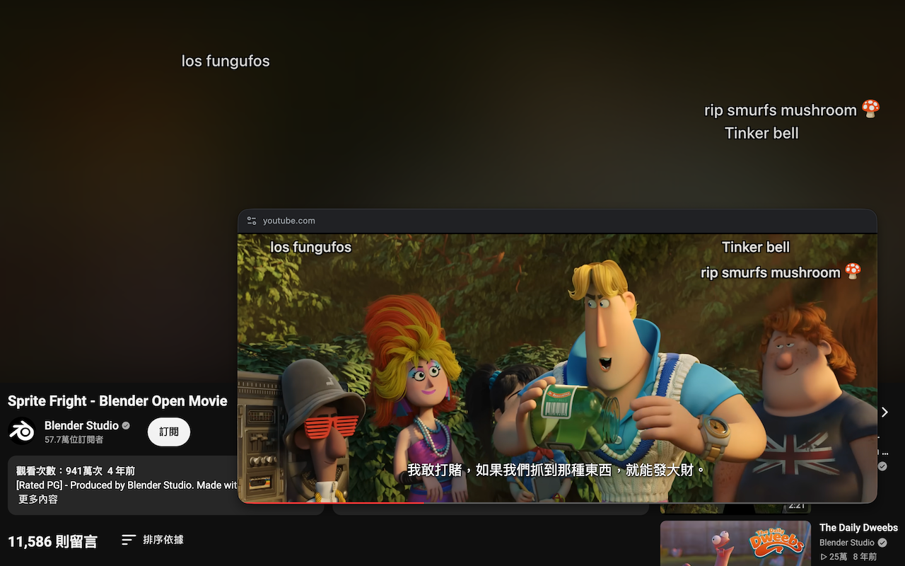
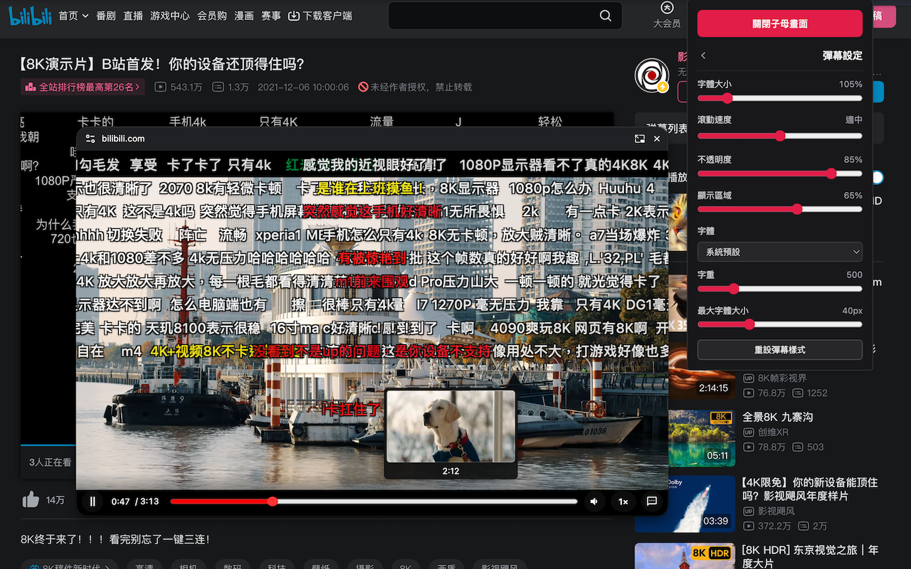

# 幕伴 PiP · PiP Companion

[English](README.md) | 繁體中文

讓網頁影片在子母畫面中播放，支援字幕、彈幕、截圖與浮動留言區。

<p align="center">
  
</p>

> 遇到問題或有功能建議，請到 [Issues](https://github.com/kir4che/pip-companion/issues) 回報。

## 功能

- **子母畫面（PiP）控制**：播放／暫停、進度條拖曳、音量、倍速、逐格等完整控制
  - **播放下一部**：自動偵測網頁中的「下一部影片／下一集」按鈕
  - **音量放大**：同源影片最高可提高至 300%；跨來源影片可能僅支援至 100%。
  - **倍速播放**：可將播放速度調整至 0.25 – 5×；在直播中會自動隱藏倍速按鈕以保持同步，且部分網站可能會限制。
  - **進度條與預覽**：控制列隱藏時底部仍常駐顯示迷你進度條，且滑鼠懸停可預覽縮圖（支援 YouTube、Bilibili 與巴哈動畫瘋）。
  - **輸入時間跳轉**：可直接輸入影片時間並跳轉至該時間點
  - **字幕**：在 PiP 中顯示影片中可讀取的字幕，並可自定義樣式；設定只套用於 PiP，不影響原網站播放器。
- **彈幕**：
  - 原生彈幕（Bilibili、巴哈動畫瘋）顯示
  - 聊天室（YouTube、Twitch）轉彈幕並顯示
  - 彈幕輸入（巴哈動畫瘋、YouTube 直播、Bilibili）
  - 樣式自定義
- **浮動留言區**：將 YouTube、Bilibili 留言區展開為浮動面板，觀看影片時也能瀏覽留言。
- **截圖**：將影片畫面存成 PNG
- **功能開關與快捷鍵**：可分別開關彈幕、截圖與浮動留言區功能，並自訂「開關 PiP、留言區、截圖與彈幕」快捷鍵。
- **嵌入影片**：偵測符合條件的 iframe 影片；跨網域相容性仍受網站結構與瀏覽器權限影響，無法保證所有播放器都能使用。

## 畫面預覽

| YouTube                                                   | Bilibili                                                    |
| --------------------------------------------------------- | ----------------------------------------------------------- |
|  |  |

## 操作與快捷鍵

- 開啟 / 關閉子母畫面（PiP）：先開啟有影片的網頁，就能透過選單中的「開啟子母畫面」按鈕或直接在影片頁面按 `Shift + Alt/Opt + P` 來開啟或關閉子母畫面。
- 自訂快捷鍵：在選單中點擊快捷鍵按鈕，顯示「按下快捷鍵…」後使用鍵盤按下新組合；按 `Esc` 取消。

### 預設快捷鍵

以下快捷鍵在支援的影片頁面即可使用，無需先開啟 PiP。

| 操作              | 快捷鍵                | 可停用？ |
| ----------------- | --------------------- | -------- |
| 開 / 關子母畫面   | `Shift + Alt/Opt + P` | —        |
| 開 / 關彈幕       | `D`                   | ✅       |
| 截圖              | `Alt/Opt + P`         | ✅       |
| 開 / 關浮動留言區 | `Alt/Opt + C`         | ✅       |

### PiP 固定快捷鍵

| 操作          | 快捷鍵                    |
| ------------- | ------------------------- |
| 播放／暫停    | `Space`                   |
| 跳轉          | `←` / `→`                 |
| 調整音量      | `↑` / `↓`                 |
| 切換字幕      | `C`                       |
| 靜音          | `M`                       |
| 逐格播放      | `,` / `.`                 |
| 調整播放速度  | `Shift + ,` / `Shift + .` |
| 彈幕輸入      | `Enter`                   |
| 調整 PiP 大小 | `Ctrl/Cmd + 滾輪`         |

## 安裝

需要 Chrome 116 或更新版本，在專案目錄執行 `npm ci`、`npm run build`，接著前往 `chrome://extensions`，開啟「開發人員模式」，並載入 `dist/` 資料夾。

## 開發

需要 Node.js 22 LTS 或更新版本，先執行 `npm ci` 安裝依賴，再使用以下指令：

```bash
npm run lint
npm run typecheck
npm run build
```

## 支持

如果你喜歡這個專案，歡迎贊助我一杯奶茶 ヾ(_´∀`_)ﾉ

<a href="https://www.buymeacoffee.com/kir4che" target="_blank"></a>
